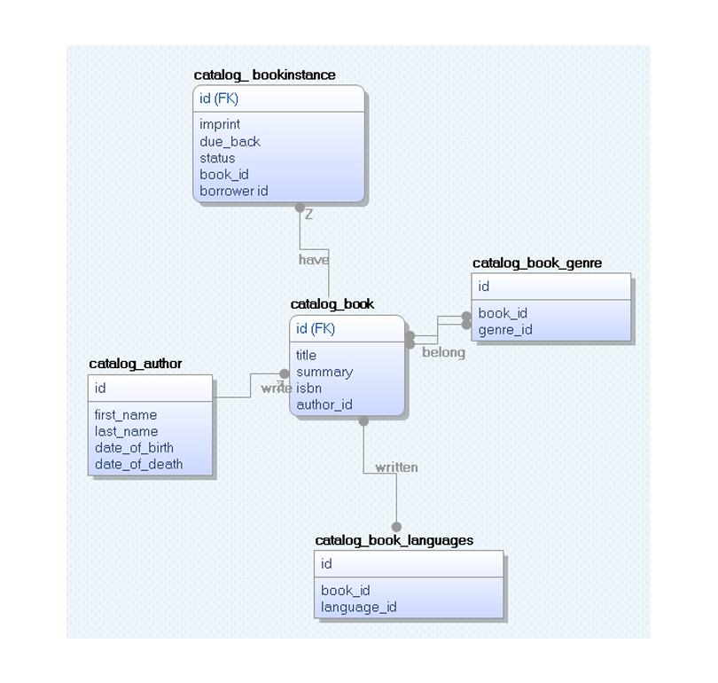

# Local Library Management System

A web-based library management system built with Django, allowing users to browse books, authors, and genres, as well as borrow and return books.

## Features

- **Book Catalog**: Search functionality to find books.
- **Author Management**: Create, update, and delete author records.
- **Genre Management**: Manage book genres.
- **Borrowing and Returning**: Users can borrow and return books.
- **User Registration and Authentication**: Secure user account management.
- **Permission-Based Access Control**: Different access levels for different users.
- **Ajax-Powered Validation**: Real-time username and email validation.

## ER Diagram

Below is the ER Diagram representing the structure of the database:


## Installation

1. **Clone the repository**:
    ```bash
    git clone https://github.com/PraveenGanapathy/locallibrary.git
    ```
2. **Install dependencies**:
    ```bash
    pip3 install -r requirements.txt
    ```
3. **Run migrations**:
    ```bash
    python3 manage.py makemigrations
    python3 manage.py migrate
    ```
4. **Collect static files**:
    ```bash
    python3 manage.py collectstatic
    ```
5. **Create a superuser**:
    ```bash
    python3 manage.py createsuperuser
    ```
6. **Run the development server**:
    ```bash
    python3 manage.py runserver
    ```

## Data Population

To populate the database with initial data, you can use the provided `datascript.py`. This script fetches book data from an external source and populates the database with authors, books, genres, and book instances.

### Steps to Run `datascript.py`:

1. **Ensure the `requests` library is installed**:
    The script automatically installs `requests` if it's not already installed.

2. **Run the script**:
    You can execute the script using the following command:
    ```bash
    exec(open('datascript.py').read())
    ```
3. The script will download data from a CSV file, extract book details, and create corresponding entries in the database, including authors, genres, books, and book instances.

## Deployment

The project is hosted on [PythonAnywhere](https://www.pythonanywhere.com/).

## Requirements

- `asgiref==3.8.1`
- `certifi==2024.7.4`
- `charset-normalizer==3.3.2`
- `dj-database-url==2.1.0`
- `Django==5.0.7`
- `idna==3.7`
- `packaging==24.1`
- `requests==2.32.3`
- `sqlparse==0.5.1`
- `typing_extensions==4.12.2`
- `tzdata==2024.1`
- `urllib3==2.2.2`
- `wheel==0.38.1`
- `whitenoise==6.6.0`

## Description

This project aims to provide a comprehensive library management system, allowing users to browse and borrow books, as well as manage authors and genres. The system includes user registration and authentication, permission-based access control, and Ajax-powered username and email validation. The project is built with Django and hosted on PythonAnywhere.
